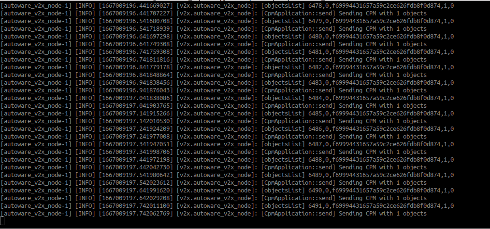

# Running AutowareV2X in the Planning Simulator

Simulations can be an easy way of verifying the functionality of AutowareV2X before an actual field test.

AutowareV2X can be run in a simulation environment using [Autoware's Planning Simulator](https://autowarefoundation.github.io/autoware-documentation/main/tutorials/ad-hoc-simulation/planning-simulation/). An ITS-S is composed of Autoware as the autonomous driving stack and AutowareV2X as its V2X communication stack. Each ITS-S is executed inside a Docker container, and the wireless communication medium between ITS-Ss are modeled with Docker networks. A dynamic ITS-S is defined as a CAV, while a static ITS-S is considered a RSU. Perceived Objects are sent out on the network as CPMs.

!!! Note
    Make sure you have completed [Autoware's Planning Simulator Tutorial](https://autowarefoundation.github.io/autoware-documentation/main/tutorials/ad-hoc-simulation/planning-simulation/) before continuing.

In order to test both the sender and receiver functionalities, we will need at least two ITS-S instances.

## The Docker environment to create

We will be creating the Docker environment as depicted in the figure below. There will be two Docker containers to represent the two ITS-Ss, each of which includes Autoware.universe and AutowareV2X. They will both be a part of the Docker network called `v2x_net` with the subnet `10.0.0.0/24`. "Autoware Container #1" and "Autoware Container #2" will be described as `autoware_1` and `autoware_2` respectively.


### Create a Docker network for V2X communication

```bash
docker network create --driver=bridge --subnet=10.0.0.0/24 v2x_net -o com.docker.network.bridge.name="v2x_net"
```


### Launch two ITS-S containers

!!! Note
    Here, we will use a Rocker extension called [off-your-rocker](https://github.com/sloretz/off-your-rocker).
    Install `off-your-rocker` by running the below:
    ```bash
    python3 -m pip install off-your-rocker
    ```

In one terminal, use rocker to launch container `autoware_1`:
```bash
rocker --nvidia --x11 --user --privileged --volume $HOME/workspace/autoware_docker --volume $HOME/data --network=v2x_net --name autoware_1 --oyr-run-arg "--ip 10.0.0.2 --hostname autoware_1" -- ghcr.io/autowarefoundation/autoware-universe:latest-cuda
```

In another terminal, use rocker to launch container `autoware_2`:
```
rocker --nvidia --x11 --user --privileged --volume $HOME/workspace/autoware_docker --volume $HOME/data --network=v2x_net --name autoware_2 --oyr-run-arg "--ip 10.0.0.3 --hostname autoware_2" -- ghcr.io/autowarefoundation/autoware-universe:latest-cuda
```

## Run Planning Simulator

Run the Planning Simulator in both `autoware_1` and `autoware_2`.

In `autoware_1`:

```
cd ~/workspace/autoware_docker
source install/setup.bash
export AWID=1 # autoware_1
source ~/workspace/autoware_docker/src/v2x/autowarev2x/setup.sh
ros2 launch autoware_launch planning_simulator.launch.xml map_path:=$HOME/data/maps/sample-map-planning vehicle_model:=sample_vehicle sensor_model:=sample_sensor_kit
```

Also, in `autoware_1`, set the ego-vehicle position by clicking `2D Pose Estimate`.

Try adding some dummy cars by clicking `2D Dummy Car`.
Note that you can make the dummy cars to be static by changing its `Velocity` to `0` in the `Tool Properties` pane.


In `autoware_2`:

```
cd ~/workspace/autoware_docker
source install/setup.bash
export AWID=2 # autoware_2
source ~/workspace/autoware_docker/src/v2x/autowarev2x/setup.sh
ros2 launch autoware_launch planning_simulator.launch.xml map_path:=$HOME/data/maps/sample-map-planning vehicle_model:=sample_vehicle sensor_model:=sample_sensor_kit
```


## Run AutowareV2X

In another terminal, connect to the `autoware_1` and `autoware_2` containers, and start AutowareV2X in both of them. We will set `autoware_1` to be the CPM sender, and `autoware_2` to be the CPM receiver.

In `autoware_1`:
```
docker exec -it autoware_1 bash
sudo su
cd workspace/autoware_docker
source install/setup.bash
export AWID=1
source ./src/v2x/autowarev2x/setup.sh
ros2 launch autoware_v2x v2x.launch.xml network_interface:=eth0
```

You should see the command output like below.
It shows that you are "Sending CPM with n objects", and the `[objectsList]` line describes the following information: `cpm_num, objectID, object.uuid, object.to_send, object.to_send_trigger`.


In `autoware_2`:
```
docker exec -it autoware_2 bash
sudo su
cd workspace/autoware_docker
source install/setup.bash
export AWID=2
source ./src/v2x/autowarev2x/setup.sh
ros2 launch autoware_v2x v2x.launch.xml network_interface:=eth0 is_sender:=false
```

When both the sender and receiver is launched, you should see that the receiver (`autoware_2`) will start receiving CPMs like below.


## Show CPM-shared objects in RViz

1. Press "Add" from the Displays Panel <br>

2. Choose "By topic", then select PredictedObjects from /v2x/cpm/objects <br>

3. The CPM-shared objects are shown in Rviz for `autoware_2`! <br>


## Run scenarios

In order to run scenarios, the [scenario_simulator_v2](https://github.com/tier4/scenario_simulator_v2.git) must be installed:

1. Launch new Autoware container
```
rocker --nvidia --x11 --user --volume $HOME/workspace/autoware_docker --volume $HOME/data -- ghcr.io/autowarefoundation/autoware-universe:latest-cuda
```
2. Add `simulator.repos`
```
cd workspace/autoware_docker
vcs import src < simulator.repos
```
3. Install dependent ROS packages
```
sudo apt update
rosdep update
rosdep install --from-paths src --ignore-src --rosdistro $ROS_DISTRO -r
```
4. Rebuild workspace
```
colcon build --symlink-install --cmake-args -DCMAKE_BUILD_TYPE=Release
```
5. Download scenario.
```bash
gdown -O ~/data/scenarios/ 'https://drive.google.com/uc?id=1FXwSSWeFDTMz7qsG-J7pyJA6RgjksqCy'
```
6. Launch `scenario_test_runner` and specify scenario.
```
ros2 launch scenario_test_runner scenario_test_runner.launch.py map_path:=$HOME/data/maps/sample-map-planning sensor_model:=sample_sensor_kit vehicle_model:=sample_vehicle scenario:=$HOME/data/scenarios/busy_kashiwa_scenario.yaml launch_autoware:=true
```